# Architecture Documentation

This document describes the architecture of Hackify, a Hackify-inspired music streaming application.

## Table of Contents

1. [High-Level Architecture](#high-level-architecture)
2. [Frontend Architecture](#frontend-architecture)
3. [Backend Architecture](#backend-architecture)
4. [Player State Management](#player-state-management)
5. [Data Flow](#data-flow)
6. [Database Schema](#database-schema)

---

## High-Level Architecture

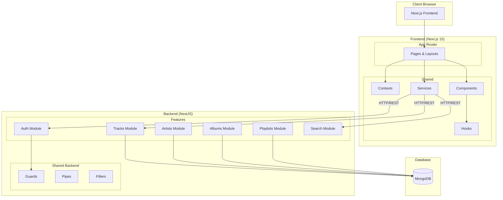

---

## Frontend Architecture

### Component Structure

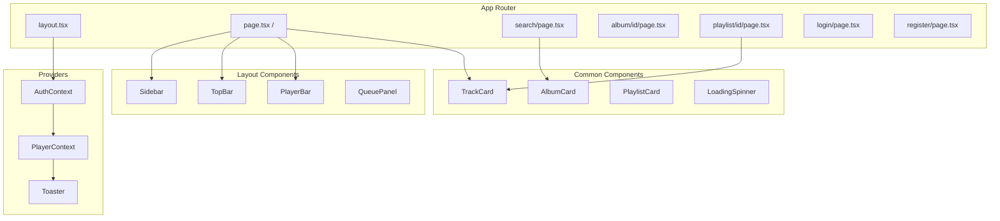

### State Management Flow

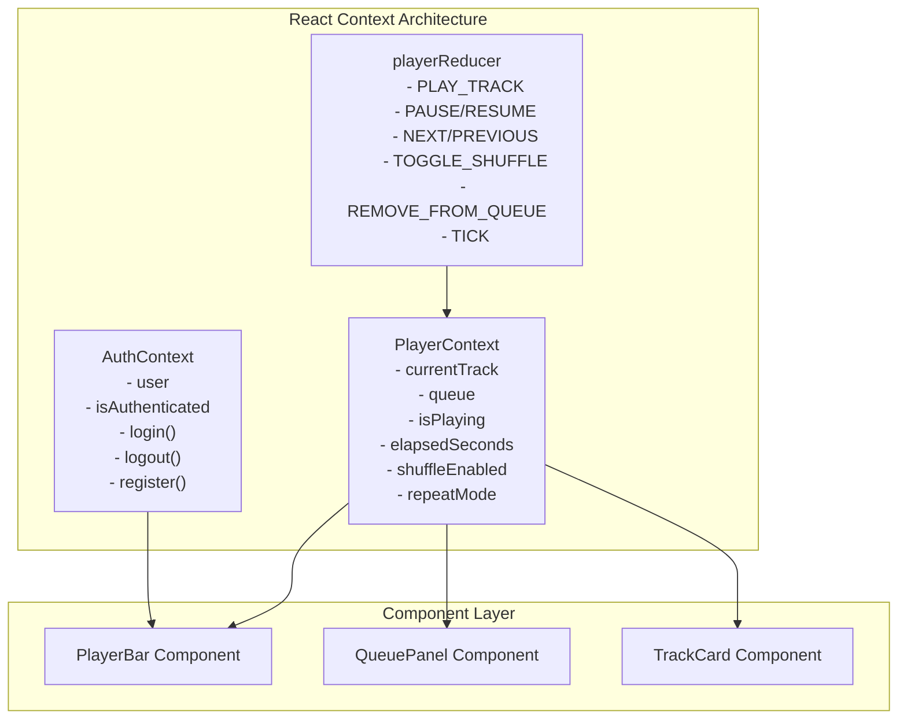

---

## Backend Architecture

### Feature-Based Module Structure

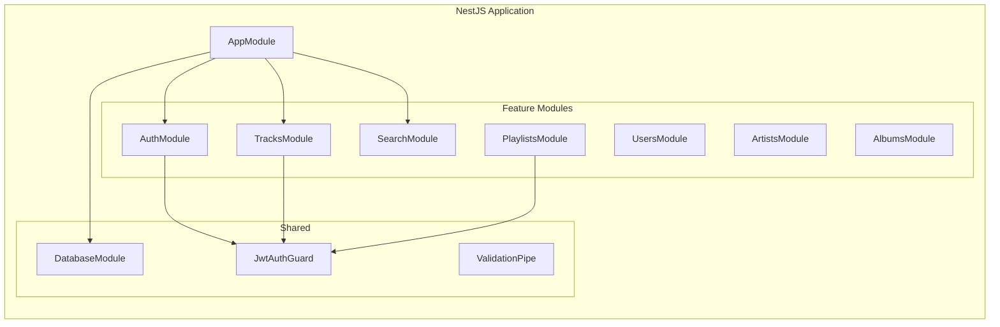

### Module Internal Structure

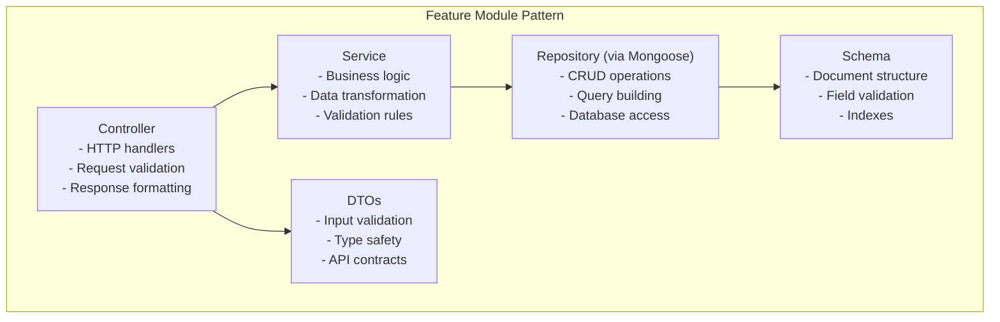

---

## Player State Management

### Reducer Actions

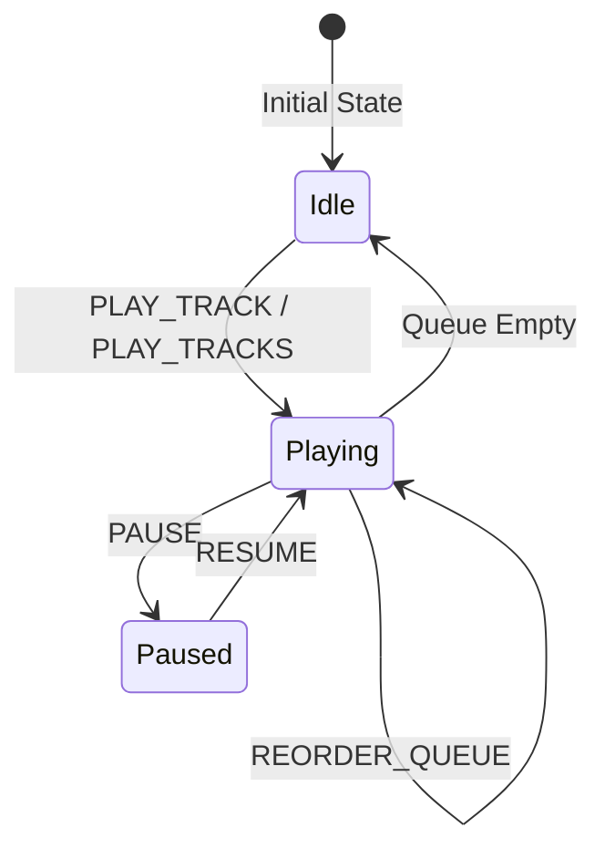

### Shuffle Toggle Flow (Bug B Location)

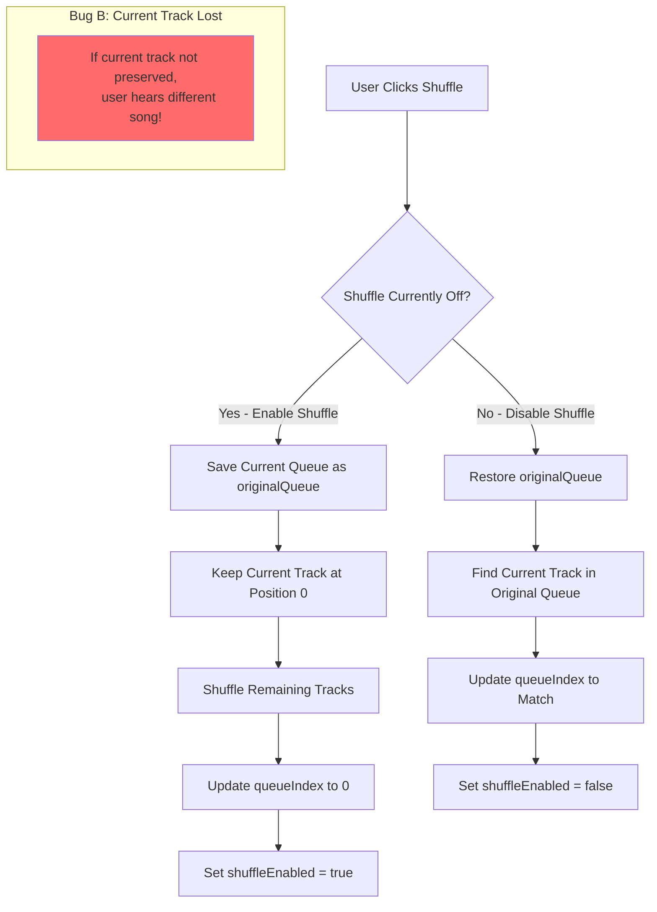

### Remove from Queue Flow (Bug F Location)

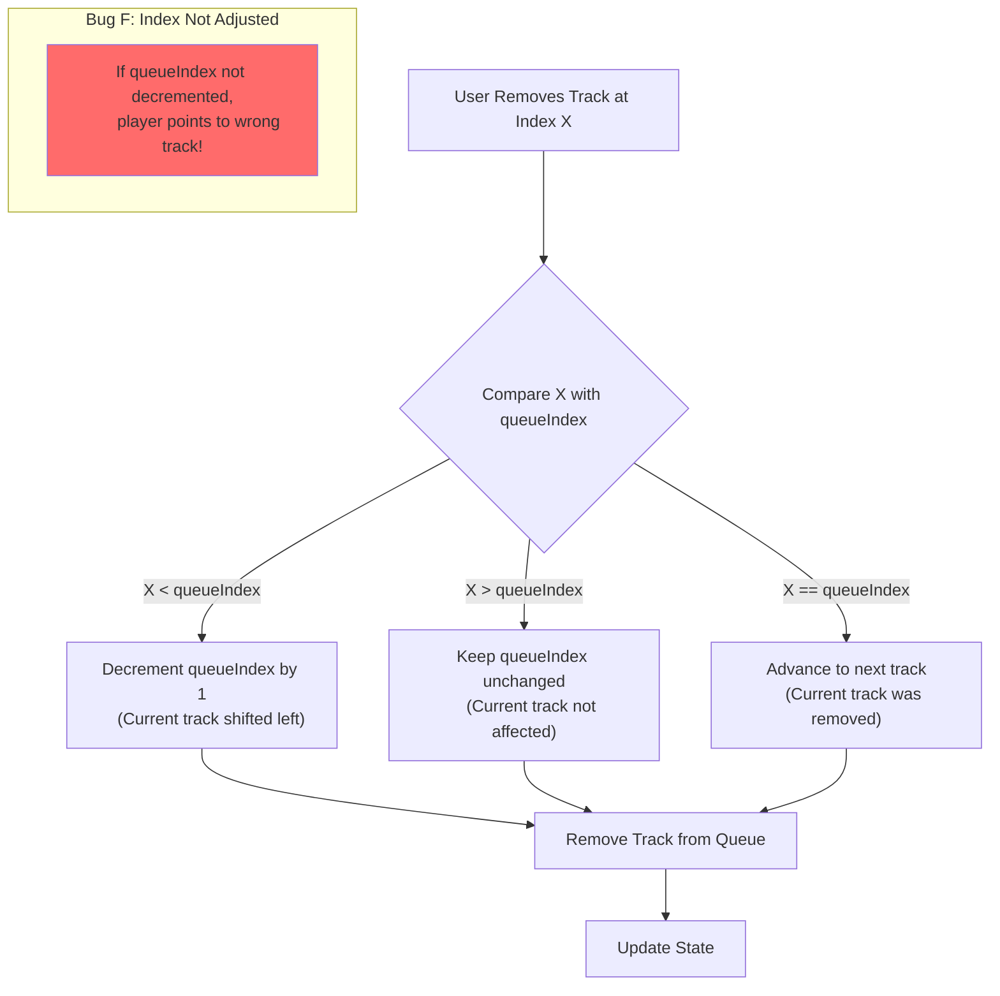

### Timer Management (Bug G Location)

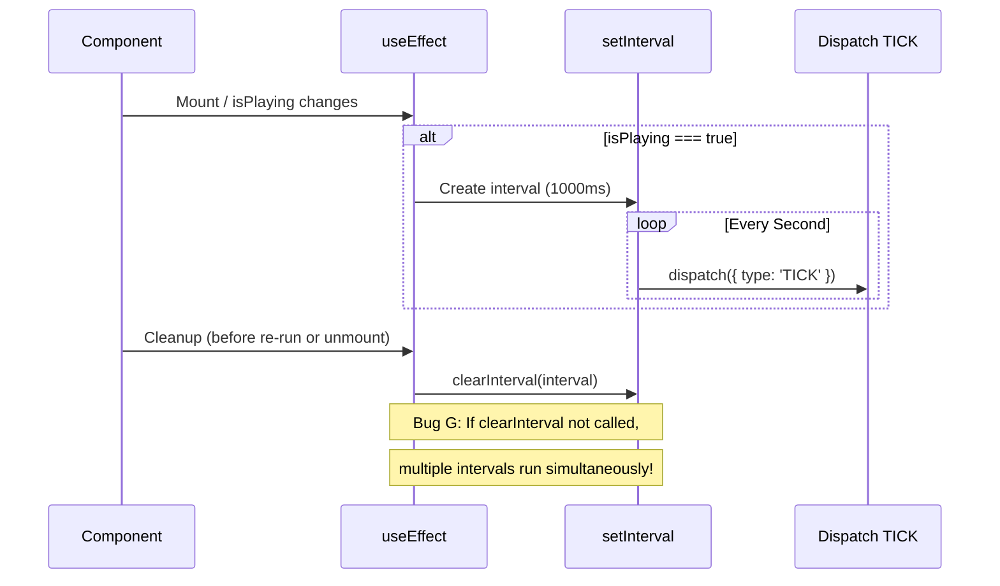

---

## Data Flow

### Search Flow (Bug D Location)

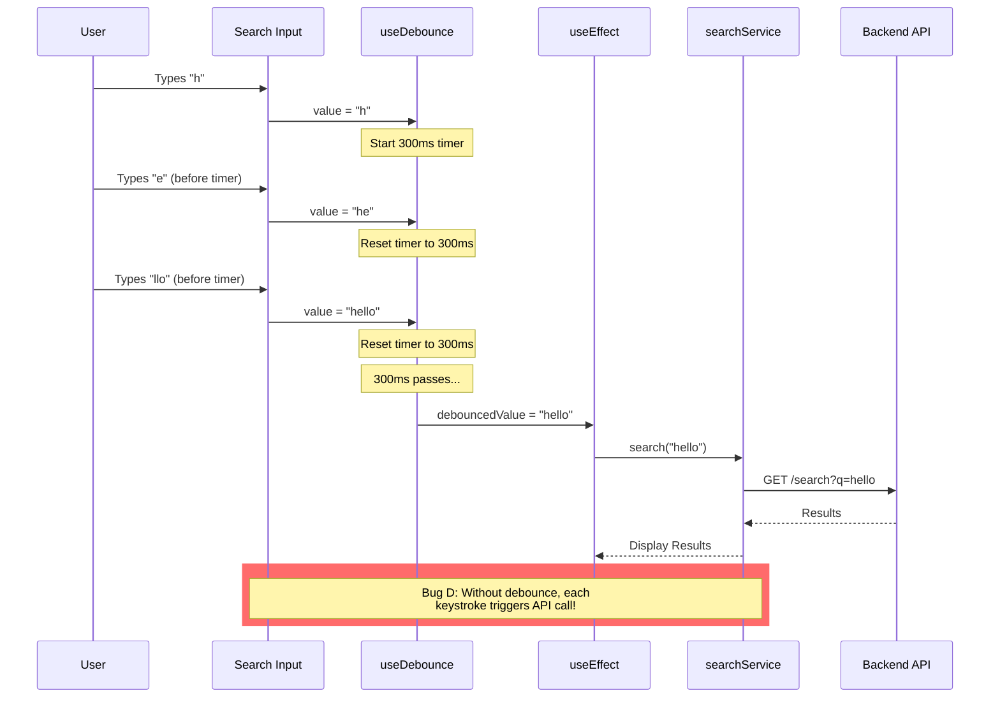

### Authentication Flow

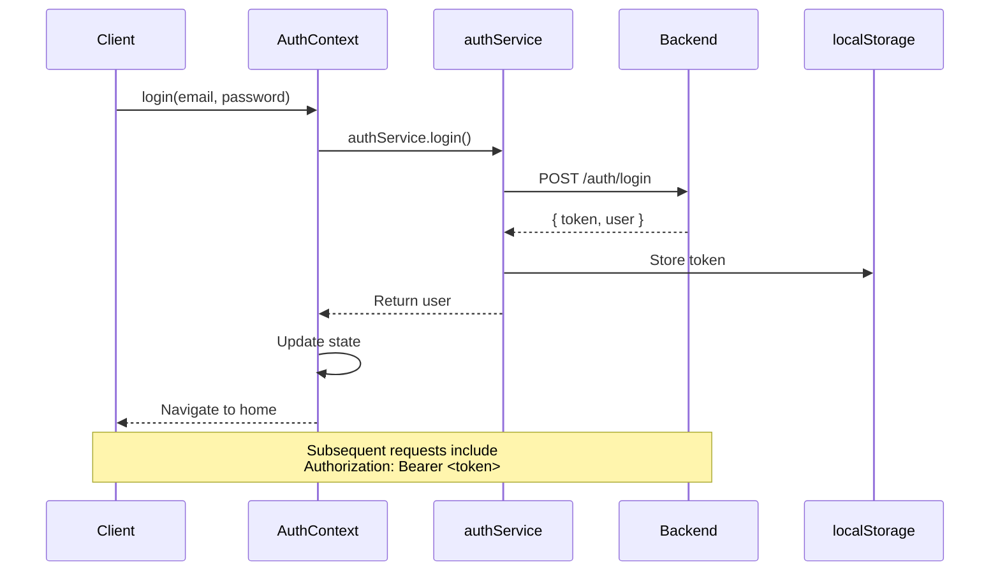

---

## Database Schema

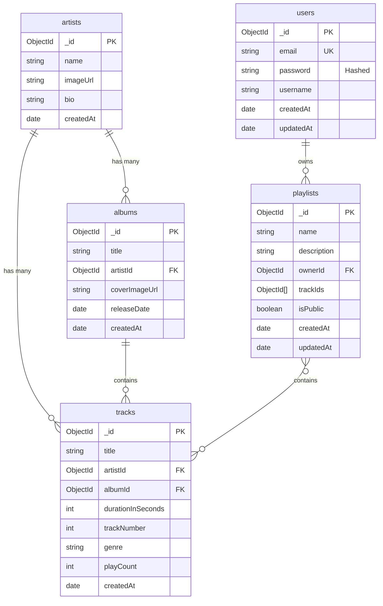

---

## Component Interactions

### Player Bar Component Flow

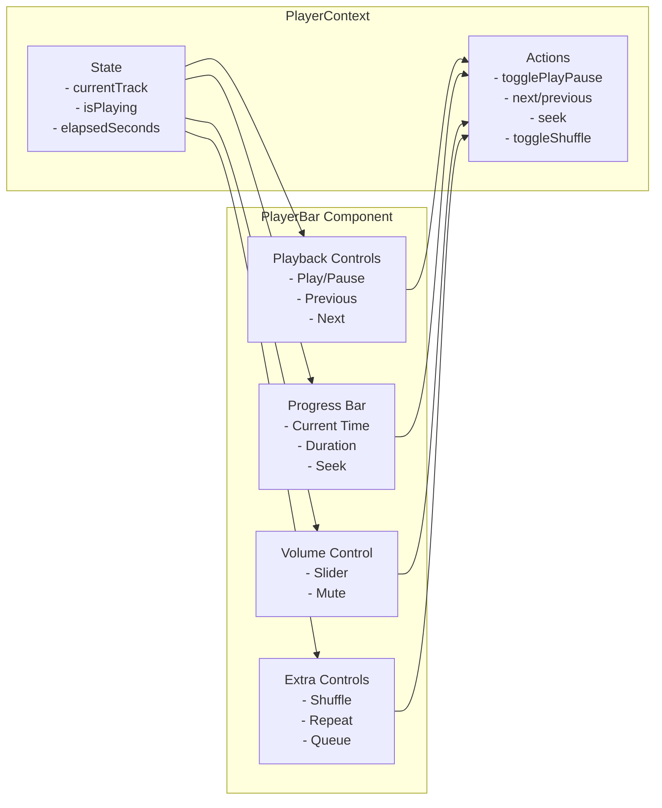

---

## Testing Architecture

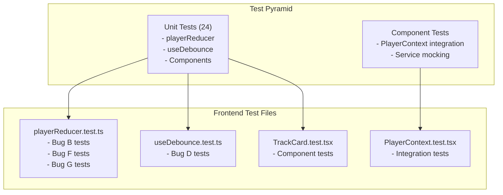

---

## Key Design Decisions

### 1. React Context vs Redux

**Choice**: React Context with useReducer

**Rationale**:
- Simpler setup, no external dependencies
- Sufficient for application complexity
- HackerRank challenge constraint (no Redux/Zustand)
- Reducer pattern provides predictable state updates

### 2. Simulated Playback

**Choice**: Timer-based playback simulation

**Rationale**:
- No actual audio files needed
- Focuses on state management challenges
- Easy to test with fake timers
- Demonstrates interval cleanup patterns

### 3. Feature-Based Backend Structure

**Choice**: Modules organized by feature

**Rationale**:
- Clear separation of concerns
- Easy to navigate and understand
- Standard NestJS pattern
- Scalable for adding new features

### 4. Native Fetch vs Axios

**Choice**: Native Fetch API

**Rationale**:
- No additional dependencies
- Modern browser support
- HackerRank challenge constraint
- Simpler for assessment context
