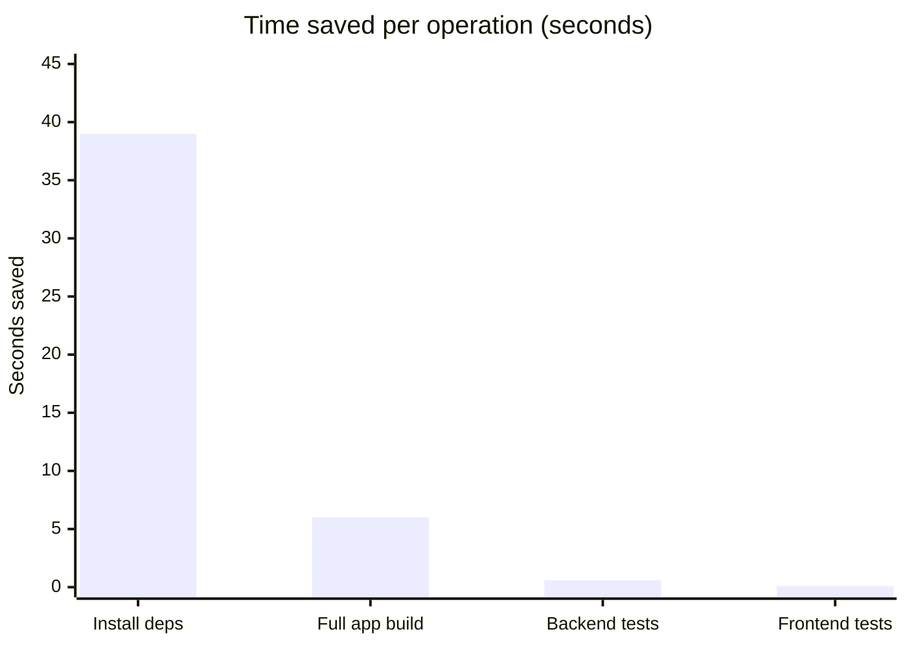

# Melodio — Technical Changes Report

| | |
|---|-----|
| **Project** | Melodio (Music Player App — MERN Stack Monorepo) |
| **Report type** | Post-optimization summary (optimized for candidate interview experience) |
| **Version** | 1.0.0 |

---

## 1. Introduction

This report summarizes the technical optimization work done on the Melodio codebase. The work was done **to improve the candidate interview experience**: we wanted the project to run faster, give quicker feedback, and avoid tooling getting in the way so that candidates can focus on the actual tasks.

The work is complete. Quality checks (lint, typecheck, and unused-code detection) all pass from the repo root. The sections below explain what was done, why it matters for candidates, and how to run the project.

**Key findings**

- **Install:** ~44 s → ~5 s (npm → Bun).  
- **Full app build:** ~11 s → ~5 s (Vite + Bun).  
- **Backend tests:** ~2.5 s → ~1.9 s (Jest + SWC).  
- **Frontend tests:** ~4.2 s → ~4.1 s (Jest → Vitest).  
- **Dependencies:** Locked via exact versions and `bun.lock`; reproducible installs and pre-build/pre-start checks.  
- **Candidate experience:** Quality pipeline does not block on candidate code; contract files keep tooling from flagging scaffold or task exports as unused.

### All changes at a glance

| # | Area | What changed | Before | After | Where |
|---|------|----------------|--------|--------|--------|
| 1 | Package manager | Switched from npm to Bun for install, scripts, and backend runtime | npm, `package-lock.json` | Bun, `bun.lock` | Root `package.json`, `backend/package.json` |
| 2 | Locked dependencies | Exact versions in `package.json`; single lockfile; `deps:check` and prebuild/prestart | — | Exact versions, `bun.lock`, `bun run deps:check` | Root `package.json` |
| 3 | Workspaces | Monorepo with frontend + backend at root | — | `workspaces: ["frontend", "backend"]` | Root `package.json` |
| 4 | Frontend build | Replaced previous build with Vite + React plugin | Prior build setup | Vite, `tsc && vite build` | `frontend/package.json`, Vite config |
| 5 | Frontend dev server | Dev server now runs through Vite | — | Vite dev server | `frontend/package.json` |
| 6 | Frontend tests | Switched from Jest to Vitest | Jest | Vitest, jsdom, coverage | `vitest.config.frontend.ts`, `vitest.workspace.ts`, `frontend/package.json` |
| 7 | Backend tests | Added SWC as Jest transpiler | Jest only | Jest + SWC | `backend/jest.config.cjs`, `backend/package.json` |
| 8 | Unused code check | Added Knip for unused files, exports, deps; contract files as entry | — | Knip, contract files, ignoreFiles for scaffold | `knip.json`, `candidate-contracts/*.ts` |
| 9 | Lint | Lint script uses contract-aware run so candidate code doesn’t block | — | `scripts/quality/lint-noncandidate.mjs` | Root `package.json`, `scripts/quality/` |
| 10 | Typecheck | Typecheck uses contract-based entry for pipeline; full strict available | — | `scripts/quality/typecheck-noncandidate.mjs`, `typecheck:strict` | Root `package.json`, `scripts/quality/` |
| 11 | Backend app | Public dir helper for Node/Bun; both `/api/payment` and `/api/payments` | — | `getPublicDir()`, route registration | `backend/src/app.ts` |
| 12 | Root scripts | Unified test/quality commands; prebuild, prestart, deps:check | — | `test`, `test:task1`…`test:task13`, `check:quality`, hooks | Root `package.json` |
| 13 | Candidate contracts | Re-export candidate symbols so Knip/typecheck treat them as used | — | `candidate-frontend-contract.ts`, `candidate-backend-contract.ts` | `candidate-contracts/` |

---

## 2. Why this matters for candidates

During an interview, every minute counts. Slow installs, long builds, and sluggish test runs eat into the time candidates have to read the problem, write code, and verify their work. We optimized the project so that the toolchain supports a better interview experience.

We did that in three ways:

1. **Faster toolchain.** We switched the package manager and build/test setup so that dependency installs, full-app builds, and test runs complete in a fraction of the previous time. Candidates get a running environment quickly and see test results in seconds instead of waiting. Numbers are in the next section.

2. **Quality gates that don’t block candidates.** We introduced a single, repeatable quality pipeline (lint, unused-code check, typecheck) that runs from the repo root. It is designed so that **candidate code does not block the pipeline**—if a candidate hasn’t wired something in yet, the checks still pass. That keeps the experience fair and predictable: candidates aren’t surprised by tooling failures unrelated to their task.

3. **Contract files.** We added contract files at the repo root so our tools know which candidate exports are intentional; those symbols are not reported as unused. Scaffold files (e.g. shared components, cache service) are excluded from the unused-file check so they stay available for candidates.

The result is a project that gets candidates coding sooner, gives them fast feedback when they run tests, and avoids tooling friction so they can focus on the interview.

---

## 3. Measured impact

We captured timings before and after the changes. Exact numbers depend on the machine, but the relative gains are consistent. The charts and table below summarize the results.

### Benchmark: Before vs After (time in seconds)

```mermaid
xychart
    title "Benchmark comparison: Before vs After optimization"
    x-axis ["Install deps", "Full app build", "Backend tests", "Frontend tests"]
    y-axis "Time (seconds)" 0 --> 50
    bar [44, 11, 2.5, 4.2]
    bar [5, 5, 1.9, 4.1]
```

*Figure 1. Before (first bar) vs After (second bar) for each operation. Lower is better.*

### Improvement (reduction in time)

*Figure 2. Time saved per run. Install and full build show the largest gains.*

### Detailed benchmark data

| Metric | Before | After | Change | Notes |
|--------|--------|--------|--------|--------|
| **Installing dependencies** | 44 s (npm) | 5 s (Bun) | −39 s | Bun installs in parallel; single lockfile for monorepo. |
| **Full app build (frontend + backend)** | 11 s | 5 s | −6 s | Same output; Vite and Bun speed up runner and bundler. |
| **Running backend tests** | 2.5 s (Jest) | 1.9 s (Jest + SWC) | −0.6 s | SWC compiles TypeScript during tests. |
| **Running frontend tests** | 4.2 s (Jest) | 4.1 s (Vitest) | −0.1 s | Vitest aligned with Vite; stack is simpler. |

**Summary.** A candidate who runs a full install, build, and test cycle during the interview can expect to save on the order of a minute or more per cycle—more time to spend on the actual problem instead of waiting on the toolchain.

### Tooling structure summary

| Strategy | How it’s done |
|----------|----------------|
| Workspace at root | `workspaces: ["frontend", "backend"]`; single `bun.lock`; run from root. |
| Bun as installer | `bun install`; `packageManager: "bun@1.1.0"`; `engines.bun`. |
| Vite as bundler | Frontend: `vite`, `@vitejs/plugin-react`; dev + build. |
| Vitest (frontend tests) | `frontend/__tests__/**/*.behavior.test.tsx`; `vitest.config.frontend.ts`. |
| Jest + SWC (backend tests) | `@swc/jest` in `backend/jest.config.cjs`; `backend/__tests__/**/*.behavior.test.ts`. |
| Knip | `bun run unused:check`; entry files = contract files; optional `bunx depcheck`. |

---

## 4. What we changed (high level)

The following changes were made with the candidate experience in mind: faster setup and feedback, and no tooling surprises. The later sections go into more detail for anyone who needs to maintain or extend this setup.

**Package manager and runtime.** We moved from npm to **Bun** for installing dependencies, running scripts, and running the backend in production. The repo now has a single lockfile (`bun.lock`) at the root. The backend starts with `bun dist/server.js` instead of Node. Bun is required (version 1.0 or higher); install instructions are on the Bun site. Node.js 20+ is still supported where our tooling uses it.

**Frontend build and dev server.** The frontend is built with **Vite** and the React plugin. The build command is `tsc && vite build`; the dev server runs through Vite as well. This gives faster startup and faster rebuilds during development.

**Frontend tests.** Frontend tests were moved from Jest to **Vitest**. They now live under `frontend/__tests__/**/*.behavior.test.tsx` and are run with Vitest’s runner, which shares the same project and config as Vite. Coverage is handled by `@vitest/coverage-v8`.

**Backend tests.** We kept **Jest** for the backend but added **SWC** as the transpiler. That’s the main reason backend test time dropped from about 2.5 seconds to about 1.9 seconds. Backend tests now live under `backend/__tests__/**/*.behavior.test.ts`.

**Unused code and dependencies.** We added **Knip** to report unused files, exports, and dependencies. So that we don’t flag candidate-facing code as “unused,” we maintain two contract files at the repo root that re-export the symbols candidates are expected to use. Knip is configured to treat those contracts as entry points. We also excluded a small set of scaffold files (e.g. shared error message components, cache service) from the unused-file check, since they are intentionally present for candidates even if not imported by the app. The rule is: we never change task code for Knip; we only add symbols to the contract or, in rare cases, to the scaffold ignore list.

**Lint and typecheck.** The existing lint and typecheck setup was updated so that the *contract* files define what “counts” when running the quality pipeline. That way, candidate code does not block the pipeline if it’s not yet wired in. Full typecheck of the whole codebase is still available via `bun run typecheck:strict` when needed.

**Backend application.** We made a few small, non-behavioral changes in `backend/src/app.ts`: a helper to resolve the public directory that works under both Node and Bun, and explicit registration of both `/api/payment` and `/api/payments` so that different client code paths are supported.

---

## 5. How to run the project (quick reference)

Candidates run the following from the **repository root**.

| What you want to do | Command |
|---------------------|--------|
| Install dependencies | `bun install` |
| Start frontend and backend together | `bun start` |
| Build everything | `bun run build` |
| Run all tests (backend then frontend) | `bun run test` |
| Run the full quality pipeline (lint + Knip + typecheck) | `bun run check:quality` |
| Typecheck only | `bun run typecheck` |
| Lint only | `bun run lint` |
| Check for unused code/deps (Knip) | `bun run unused:check` |

The root `package.json` has `prebuild` and `prestart` hooks that run dependency checks before build and start.

---

## 6. Locked dependencies

We lock dependencies so that every candidate gets the same versions and the same install behavior. That reduces “works on my machine” issues and keeps the interview environment predictable.

**How we lock**

- **Exact versions in `package.json`.** Dependencies are pinned with exact versions (no `^` or `~`). For example, `"vitest": "2.1.9"` instead of `"^2.1.9"`. That way a fresh install resolves to the same versions every time.
- **Single lockfile: `bun.lock`.** The lockfile at the repo root is the source of truth for the whole monorepo. It records the full dependency tree (including transitive dependencies) so that `bun install` produces identical `node_modules` across machines.
- **Frozen install (`bun run deps:check`).** The script `bun run deps:check` runs `bun install --frozen-lockfile`. That means: install only what the lockfile allows, and do not update the lockfile. It **fails** only when `package.json` and `bun.lock` are out of sync—for example, if someone edited `package.json` (added/removed/changed a dependency) but did not run `bun install` to update the lockfile. In that case, the check fails so you fix the mismatch instead of accidentally installing different versions.
- **Pre-build and pre-start checks.** The root `package.json` has `prebuild` and `prestart` hooks that run `bun run deps:check` before `bun run build` or `bun start`. So when a candidate runs `bun run build` or `bun start`, the project first verifies that the lockfile is in sync with `package.json`. If it is (normal case after cloning and running `bun install`), the check passes and build/start run. If it isn't, the check fails and build/start do not run until the lockfile is updated.

**Will `bun install` fail?**

No. A normal **`bun install`** (without `--frozen-lockfile`) does **not** fail. It installs dependencies from the lockfile and, if you have changed `package.json`, it updates the lockfile. So after cloning, a candidate runs `bun install` once and gets the exact versions from the repo; that always succeeds. The **failure** only happens when you explicitly run the **frozen** check (`bun run deps:check` or `bun install --frozen-lockfile`) and the lockfile is out of sync, or when you run `bun run build` / `bun start` and the pre-hook runs that same check and finds a mismatch.

**Adding or updating a dependency**

From the repo root, add the dependency so that the lockfile is updated:

- Root: `bun add <pkg>` or `bun add -d <pkg>` (dev)
- Frontend: `bun add <pkg> --cwd frontend`
- Backend: `bun add <pkg> --cwd backend`

After that, commit both `package.json` and `bun.lock`. Candidates then run `bun install` and get the same versions.

---

## 7. Technical detail: structure and tooling

### Monorepo layout

The repo uses npm-style workspaces: `package.json` at the root has `workspaces: ["frontend", "backend"]`. One `bun install` at the root installs dependencies for both packages and updates the single `bun.lock`. All main commands (build, test, lint, typecheck, Knip) are intended to be run from the root so that the lockfile and scripts stay in sync.

### Bun’s role

Bun is used in three ways:

- **Install:** `bun install`. For a reproducible install (e.g. after cloning), `bun install --frozen-lockfile` uses the existing lockfile without updating it.
- **Scripts:** Every `bun run <script>` uses Bun as the runner.
- **Production backend:** The backend is started with `bun dist/server.js` (see `backend/package.json`).

The root `package.json` sets `"packageManager": "bun@1.1.0"` and `"engines": { "bun": ">=1.0.0" }`. We do not use `package-lock.json`; the source of truth for versions is `bun.lock`.

### Frontend: Vite and Vitest

The frontend is built with Vite; the build step is `tsc && vite build`. The dev server is also Vite. Tests are in `frontend/__tests__/**/*.behavior.test.tsx` and run with Vitest; the config lives in `vitest.config.frontend.ts` and the workspace in `vitest.workspace.ts`. Vitest is set up with jsdom, path aliases matching the app, and coverage via `@vitest/coverage-v8`.

### Backend: Jest and SWC

Backend tests stay in Jest; the config is `backend/jest.config.cjs`. We added the `@swc/jest` transform so that TypeScript is compiled with SWC (target `es2022`, CommonJS). Test roots now point to `backend/__tests__`, and we have a small module name mapper so that `.js` imports resolve correctly. The tests themselves are unchanged; only the way they are compiled is different.

### Knip configuration

Knip is invoked with `bun run unused:check` (which runs `knip`). The config is in `knip.json` at the root.

- **Root workspace:** Entry points include `vitest.config.frontend.ts` and repo-level scripts so workspace config files are not reported as unused.
- **Frontend:** Entry points include `../candidate-contracts/candidate-frontend-contract.ts`, `frontend/__tests__/**/*.behavior.test.tsx`, and `frontend/test/**/*`. The project includes `src/**/*.{ts,tsx}`, `__tests__/**/*.tsx`, and `test/**/*`. A few scaffold files (e.g. `ErrorMessage.tsx`, `LoadingSpinner.tsx`, `useLocalStorage.ts`) are in `ignoreFiles` because they are intentionally unused by the app but provided for candidates.
- **Backend:** Entry points are `src/app.ts`, `../candidate-contracts/candidate-backend-contract.ts`, and `backend/__tests__/**/*.behavior.test.ts`. The project includes `src/**/*.ts` and `__tests__/**/*.ts`. The scaffold file `cache.service.ts` is in `ignoreFiles` for the same reason as above.

We only list *specific* symbols in the contract files—exports, types, or functions that candidates are expected to use. We do not ignore entire task files. That keeps Knip useful for finding real dead code while avoiding false positives on candidate surface.

### Lint and typecheck scripts

- **Lint:** `bun run lint` runs `scripts/quality/lint-noncandidate.mjs`, which runs ESLint in a way that does not let candidate contract code block the pipeline.
- **Typecheck:** `bun run typecheck` runs `scripts/quality/typecheck-noncandidate.mjs`, which typechecks the codebase using the contract files as the entry surface. For a full strict typecheck of every file, use `bun run typecheck:strict`.

---

## 8. Dependencies we added or upgraded

This table lists the main libraries that were added or upgraded as part of this work. Exact versions are pinned in `bun.lock`; the table summarizes the role of each.

| Area | Library | Role |
|------|---------|------|
| Root | Bun (1.1.0; engines ≥1.0.0) | Package manager, script runner, production backend runtime |
| Root | Knip (5.86.0) | Detects unused files, exports, and dependencies |
| Frontend | Vite (6.x) | Dev server and production build |
| Frontend | @vitejs/plugin-react (4.7.0) | React support for Vite |
| Frontend | Vitest (2.1.9) | Frontend test runner |
| Frontend | @vitest/coverage-v8 (2.1.9) | Frontend test coverage |
| Frontend | Tailwind CSS (4.x) | Styling (PostCSS plugin) |
| Frontend | TypeScript (5.x) | Type checking |
| Backend | Express (5.x) | HTTP server |
| Backend | TypeScript (5.x) | Type checking |
| Backend | @swc/jest | Jest transpiler for faster backend tests |

---

## 9. File-by-file summary of changes

### Root

- **`package.json`:** Configured workspaces (`frontend`, `backend`), switched all scripts to Bun, and defined the main commands: `test` runs backend Jest then frontend Vitest; `test:task1` through `test:task13` run tests for a single task; `check:quality` runs lint, then `unused:check` (Knip), then typecheck. Added `prebuild` and `prestart` so that dependency and setup checks run before build and start.

### Backend

| File | What changed |
|------|------------------|
| `backend/package.json` | Scripts updated to use Bun; the start script runs `bun dist/server.js`; test setup uses Jest with SWC. |
| `backend/jest.config.cjs` | Added SWC transform for TypeScript; set test roots to `backend/__tests__`; added module name mapper for `.js` resolution. |
| `backend/src/app.ts` | Introduced `getPublicDir()` that uses `__dirname` when available (Node) and falls back to `process.cwd()` (e.g. Bun). Serves static files from that directory and registers both `/api/payment` and `/api/payments` with the same payment routes so that different client code can call either path. |

No other backend source files were changed. In particular, no candidate-facing services (e.g. tracks, playlists, payment logic) were modified.

### Frontend

- **`frontend/package.json`:** Build and dev scripts now use Vite; the test script runs Vitest. Dependencies were updated to include Vite, the React plugin, Vitest, coverage, and the current Tailwind and TypeScript versions.

### Config and scripts

| File or area | Purpose |
|--------------|--------|
| `knip.json` | Defines entry points per workspace (tests and contract files), `ignoreFiles` for scaffold-only files, and `ignoreDependencies` / `ignoreBinaries` for test and build tooling so they are not reported as unused. |
| `vitest.workspace.ts`, `vitest.config.frontend.ts` | Vitest workspace and frontend project config: jsdom, aliases, coverage. |
| `scripts/quality/lint-noncandidate.mjs` | Runs ESLint in a way that keeps candidate contract from blocking lint. |
| `scripts/quality/typecheck-noncandidate.mjs` | Runs typecheck with contract-based entry surface. |

### Candidate contracts

The two contract files live at the repo root:

- `candidate-contracts/candidate-frontend-contract.ts`
- `candidate-contracts/candidate-backend-contract.ts`

They re-export the symbols that candidates are expected to implement or use. That way, Knip and the typecheck pipeline treat those symbols as used and do not report them as dead code or block the quality pipeline. We do not edit task implementation files for tooling; we only update the contract when we add new candidate-visible exports.

**Rules we follow:**

1. If Knip or typecheck complains about a candidate symbol, we add it to the appropriate contract; we do not change the task code.
2. We list only specific symbols (exports, types, functions) in the contract, not whole files.
3. In Knip, `ignoreFiles` is used only for scaffold/placeholder files, not for full task modules.
4. Typecheck still checks all source code; only the *entry* surface used when running the quality pipeline is contract-based.

To add a new candidate-visible symbol: re-export it from the correct contract file, then run `bun run unused:check` to confirm it is no longer reported as unused.

---

## 10. Practices: Knip and typecheck

**Knip.** Prefer adding candidate symbols to the contract rather than changing task code to satisfy Knip. Keep the contract to specific symbols; don’t put whole task files in `ignoreFiles`. Use `ignoreFiles` only for scaffold. Run `bun run unused:check` before merging so that new code doesn’t introduce unused files or exports. Avoid broad ignores that would hide real dead code.

**Typecheck.** Keep shared types (e.g. `TrackWithPopulated`, DTOs) in sync between frontend and backend. Include ambient types (e.g. for Vite) in tsconfig where needed. Use typed wrappers for third-party APIs instead of untyped constructors. Avoid passing or expecting payload fields that are not part of the API types.

---

## 11. Verification

From the repository root, the following commands complete successfully:

| Check | Command | Result |
|-------|--------|--------|
| Typecheck | `bun run typecheck` | Pass |
| Lint | `bun run lint` | Pass |
| Knip | `bun run unused:check` | Pass |
| Full quality pipeline | `bun run check:quality` | Pass (lint, then Knip, then typecheck) |

The `prebuild` and `prestart` hooks ensure that dependency and setup checks run before build and start.

---

## 12. Summary

| Area | Change | Reason |
|------|--------|--------|
| Package manager | Bun | Faster installs for candidates, one lockfile, Bun as backend runtime |
| Locked dependencies | Exact versions + `bun.lock` | Reproducible installs; `deps:check` and prebuild/prestart enforce lockfile |
| Workspaces | frontend and backend at root | Single install and lockfile for the monorepo |
| Frontend bundler | Vite | Fast dev server and production build; less wait time during the interview |
| Frontend tests | Vitest | Aligned with Vite; quick test feedback |
| Backend tests | Jest + SWC | Faster test runs; candidates see results in under 2 seconds |
| Unused check | Knip | Surfaces unused files, exports, and deps; contracts keep candidate code from being flagged |
| Backend app | getPublicDir, payment routes | Node/Bun compatibility and route coverage |
| Candidate contracts | Entry surface for Knip/typecheck | Contract files re-export candidate symbols so quality tools treat them as used |

Overall, the project is **optimized for candidates** so that their interview experience is smoother: less time on setup and tooling, more time on the problem, and no surprises from quality checks blocking them before they’ve finished wiring their code.

---

This report should be updated when we make further optimizations or structural changes to the repository.
