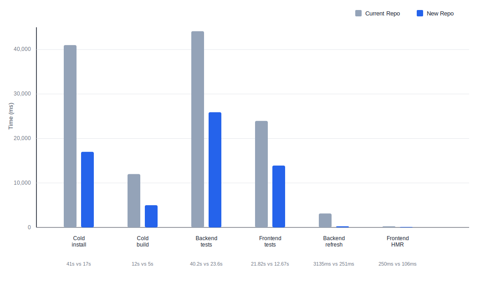

# Melodio Repo Improvement Report

## Highlights

| Area | Older state | New state | Result |
| --- | --- | --- | --- |
| Package manager | `npm` | `Bun` | Package install and run flow is faster and simpler. |
| Install flow | `prestart + setup.sh + npm install + seed` | `postinstall + prestart + setup.sh modes` | Install is faster and app start no longer waits on install work. |
| Start flow | `prestart + setup.sh` | `prestart + setup.sh --start` | Starting the app is now lighter and faster. |
| Dependency lock | `package-lock.json` | `bun.lock` | Dependency installs are easier to trust. |
| Backend dev loop | `nodemon --delay 2500ms --exec tsx` | `bun --watch` | Backend code changes show up much faster. |
| Backend build | `tsc + node` | `bun build + bun` | Backend build is faster and the run flow is simpler. |
| Frontend build | `Vite` | `Vite` | Frontend build stays the same, but finishes faster. |
| Backend tests | `ts-jest` | `@swc/jest` | Backend tests run faster with less overhead. |
| Frontend tests | `Jest` | `Vitest` | Frontend tests have a faster dedicated path. |
| Task test runs | `Jest multi-project` | `parallel backend + frontend` | Task test feedback comes back faster. |
| Quality checks | `tsc` | `lint-solution-diff + typecheck-solution-diff + knip-solution-baseline` | Code issues are caught in more places. |
| Unused dependency checks | `none` | `Knip` | Unused packages are easier and faster to spot. |
| Dependency upgrades | `npm + Jest + ts-jest + Tailwind 3` | `Bun + Vitest + @swc/jest + Tailwind 4` | The overall tool setup is faster and more up to date. |

## Benchmark Snapshot

Method: cold install and cold build below use the VM measurements. Task timings are warm timings after one warm-up run.

| Metric | Current Repo | New Repo |
| --- | ---: | ---: |
| Cold install | `41s` | `17s` (`2.4x faster`) |
| Cold build | `12s` | `5s` (`2.4x faster`) |
| Backend tests (`7` suites / `52` tests) | `40.2s` | `23.6s` (`1.7x faster`) |
| Frontend tests (`7` suites / `87` tests) | `21.82s` | `12.67s` (`1.7x faster`) |
| Backend dev refresh | `3135ms` | `251ms` (`12.5x faster`) |
| Frontend HMR | `250ms` | `106ms` (`2.4x faster`) |

## Combined Bar Graph

## What Changed

### Installer, Startup, and Seed Flow

- old root start path: `prestart` ran `bash setup.sh`
- old `setup.sh` always did all of this together:
  - Mongo check/start
  - copy both `.env.example` files over the real `.env` files
  - `npm install`
  - `npm run seed`
- old root `start` then launched frontend and backend through npm workspace scripts

The new flow splits those responsibilities:

- Bun is the declared package manager
- `bun.lock` is the dependency source of truth
- `postinstall` runs `bash setup.sh --ensure-seeded`
- `prestart` runs `bash setup.sh --start`
- `setup.sh --start` only does Mongo and env-file checks
- `setup.sh --ensure-seeded` only seeds when needed
- `setup.sh --seed` is the force-seed path
- build-related checks use `bun install --frozen-lockfile --ignore-scripts`
- root `start` launches frontend and backend through Bun scripts instead of npm workspace calls

### Backend Tooling

- Dev refresh moved from `nodemon + tsx` to Bun watch mode
- Backend build moved from `tsc` output to `bun build`
- Backend runtime also stayed aligned with Bun

### Frontend Tooling

- frontend build stays on `Vite`
- frontend tests were split into a dedicated Vitest path
- Vite-based frontend tooling stayed in place
- Tailwind moved to v4
- the original Melodio theme colors were restored

### Backend Test Changes

- backend tests still use Jest
- the transform moved from `ts-jest` to `@swc/jest`
- tests run with `NODE_ENV=test`
- backend behavior test matching became more focused
- worker count is controlled with `maxWorkers: 1`
- task-level test runs can now be launched in parallel with the frontend side

### Frontend Test Changes

- frontend package tests use Vitest
- task-level runs can launch the frontend side together with the backend side
- this removed the older feeling of one large shared test path

### Lint, Typecheck, and Unused Dependency Checks

- lint flow is more explicit
- typecheck flow is more explicit
- Knip signal improved after cleanup
- duplicate package declarations were removed
- stale ignore rules were reduced
Branch difference:

| Check | Optimised Question | Optimised Solution |
| --- | --- | --- |
| Lint | runs through `lint-solution-diff.mjs`, which is solution-aware | runs direct `eslint . --ext .ts,.tsx` |
| Typecheck | runs through `typecheck-solution-diff.mjs`, which is solution-aware | runs direct frontend and backend `tsc --noEmit` |
| Unused dependency check | runs through `knip-solution-baseline.mjs`, which is solution-aware | runs direct `knip` |

`Optimised Question` uses wrapper scripts. `Optimised Solution` runs the direct tools.

## Dependency Lock Story

This part is important because it affects every install.

Older state:

- npm-driven install story
- `package-lock.json` was the normal lockfile shape
- package manager choice was less explicit

Current state:

- Bun is declared in `packageManager`
- Bun is also declared in `engines`
- `bun.lock` is committed and used as the main lockfile
- build-related flows check lockfile consistency

Practical result:

- installs are more repeatable
- package manager expectations are clearer
- dependency resolution is easier to reason about

## Dependency Upgrades

### Root-Level Tooling

| Package / Tool | Older state | Optimised Question |
| --- | --- | --- |
| package manager contract | npm-based | Bun-based |
| root frontend test tooling | older Jest style | Vitest added |
| lint tooling | lighter structure | ESLint + `typescript-eslint` + `globals` |
| unused dependency tooling | not part of old baseline | Knip added |
| lockfile | npm-style | `bun.lock` |

### Backend Packages

| Package | Older version | Optimised Question version |
| --- | --- | --- |
| `express` | `^4.21.2` | `5.2.1` |
| `mongoose` | `^8.9.4` | `8.23.0` |
| `dotenv` | `^16.4.7` | `16.6.1` |
| `express-validator` | `^7.2.1` | `7.3.1` |
| `jsonwebtoken` | `^9.0.2` | `9.0.3` |
| `morgan` | `^1.10.0` | `1.10.1` |
| `tsx` | `^4.19.2` | `4.21.0` |
| `typescript` | `^5.7.2` | `5.9.3` |

Backend dependency cleanup also included:

- `nodemon` removed from the active dev path
- `ts-jest` removed from the backend test transform path
- `@swc/jest` added

### Frontend Packages

| Package | Older version | Optimised Question version |
| --- | --- | --- |
| `tailwindcss` | `^3.4.17` | `4.2.1` |
| `@tailwindcss/postcss` | not in old setup | `4.2.1` |
| `vite` | `^6.0.5` | `6.4.1` |
| `@vitejs/plugin-react` | `^4.3.4` | `4.7.0` |
| `typescript` | `^5.7.2` | `5.9.3` |
| `react` | `^19.0.0` | `19.2.4` |
| `react-dom` | `^19.0.0` | `19.2.4` |
| `react-router` | `^7.1.1` | `7.13.1` |
| `react-router-dom` | `^7.10.1` | `7.13.1` |
| frontend test runner | Jest | Vitest |

### Dependency Cleanup

- duplicate root package declarations were removed
- frontend-owned and backend-owned packages were kept in the right workspace
- Knip ignore rules were cleaned up
- the repo now has a more honest unused-dependency signal

## Styling and Library Upgrade Work

- Tailwind was upgraded to v4
- the Melodio color palette was restored
- the theme setup was aligned with what the app expects

## Small Code-Side Cleanup

- script entry points were simplified so install, start, seed, build, and test responsibilities are easier to follow
- redundant dependency declarations at the root were removed so workspace ownership is clearer
- stale Knip ignore rules were cleaned up so unused dependency reporting is more honest
- test/config entry points were aligned so frontend and backend test flows are easier to target
- a few unnecessary typed wrappers and config-only noise points were reduced where they were only adding maintenance overhead

## Final Summary

Compared with `Actual Solution`, `Optimised Solution` is clearly ahead on the main tooling and workflow benchmarks in this report.

- cold install is much faster
- cold build is faster
- the representative backend task test is faster
- the representative frontend task test is faster
- backend save-and-refresh time is dramatically faster
- frontend HMR is also faster on the measured comparison

At the repo level, install, lockfile handling, backend dev, backend build, frontend build, test targeting, and dependency hygiene are all in a cleaner state than the older setup.
