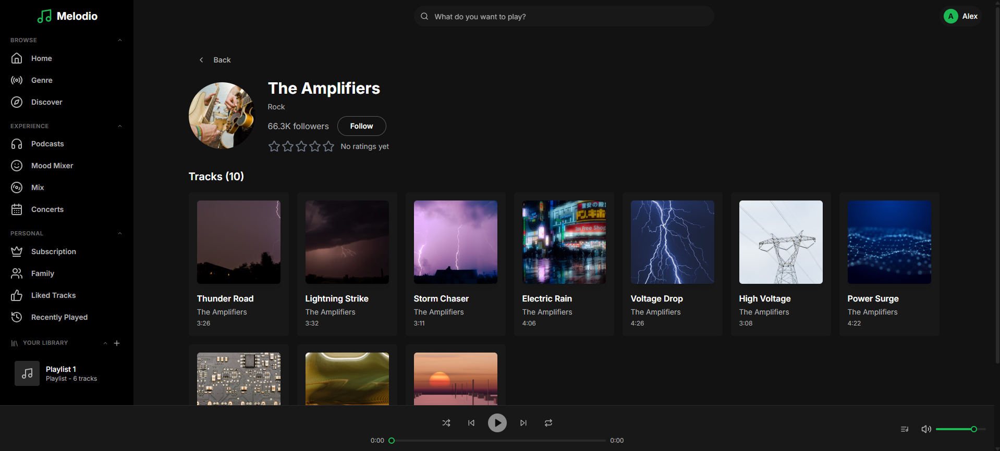
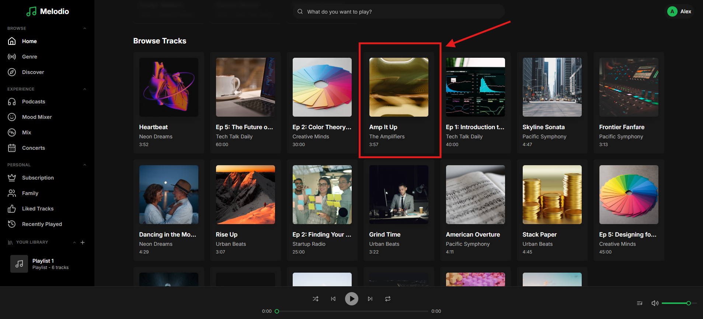
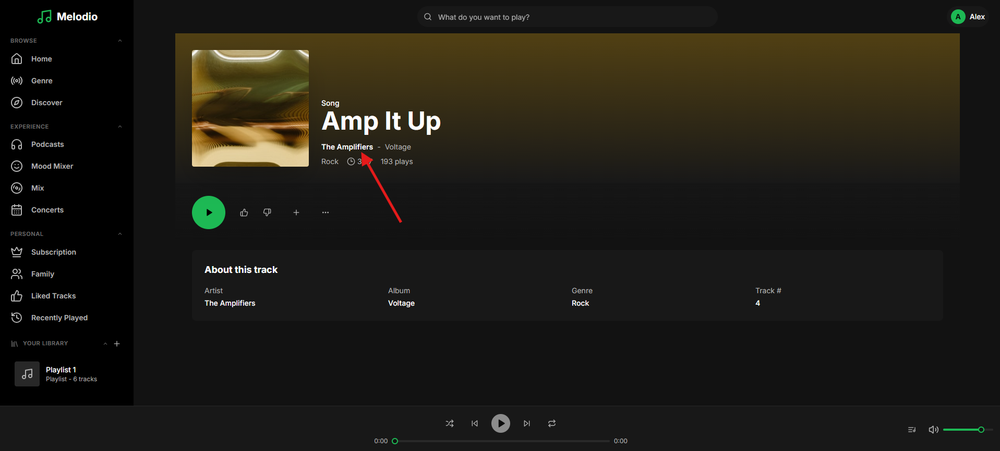
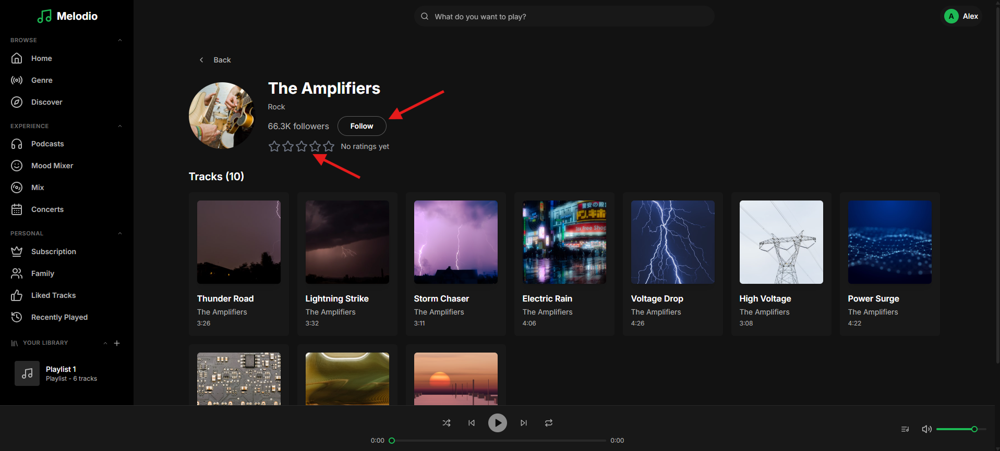

# Bug Fix: Artist Follow & Rating

```
Tags: Theme:Melodio, MERN, backend, Bug Fix, Easy
Time: 30 mins
Score: 50
```

## Overview

**Skills:** Node.js (Basic)

Melodio is a music streaming app where users can follow their favorite artists and rate them. Following an artist subscribes the user to updates, and ratings contribute to the artist's overall community score. These interactions are tracked per user and displayed on artist profile pages.



## Issue Summary

When a user clicks the Follow button on an artist's profile, nothing happens. Rating an artist also has no effect. Your task is to fix these backend issues so the artist follow and rating system works smoothly end-to-end.

## Steps to Reproduce

- Log in using test credentials:
  ```
  Email: alex.morgan@melodio.com
  Password: password123
  ```
- Click on any track to navigate to the track details page.

- Click on the Artist hyperlink to navigate to any artist's profile page.

- Click the "Follow" button; observe the button is unresponsive.
- Try to rate the artist; observe that is not captured.


## Expected Behavior

- Following an unfollowed artist should increment the follower count by 1. Unfollowing should decrement by 1.
- Ratings should be accepted within a valid range.
- The displayed rating should reflect the true community average.
- The interaction data should return the correct follow status and rating.
- Interacting with a non-existent artist should return an error.

**Note:** Make sure to review the `technical-specs/ArtistInteraction.md` file carefully to understand all the specifications and expected behavior.
