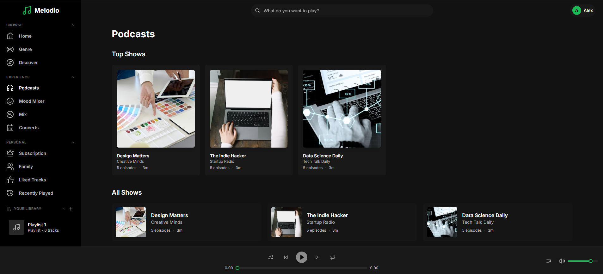
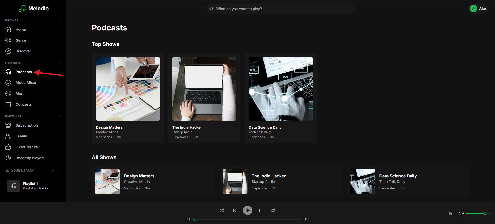
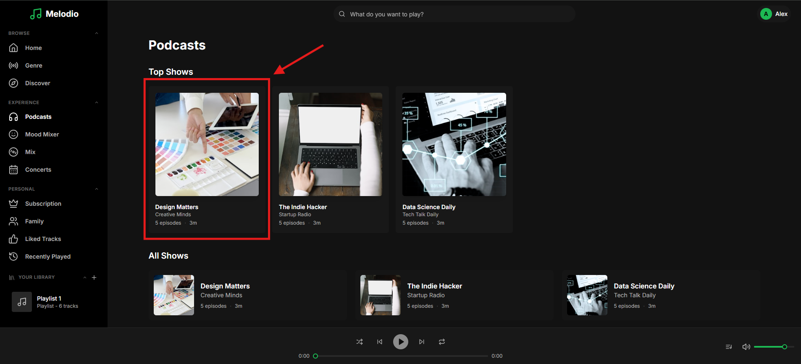
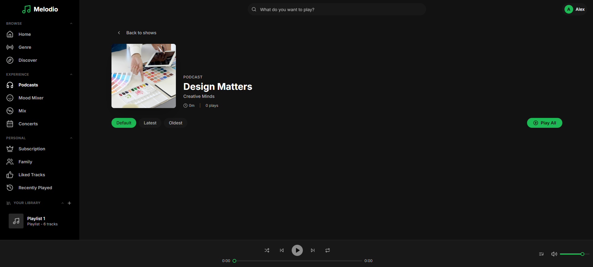

# Bug Fix: Podcast

```
Tags: Theme:Melodio, MERN, Frontend, Bug Fix, Hard
Time: 60 mins
Score: 100
```

## Overview

**Skills:** React (Advanced)

Melodio is a music streaming app that also hosts podcasts. The Podcast lets users explore podcast shows, view episode details, read descriptions, and play episodes.

At the moment, the podcast feature is extensively broken. Show durations are wrong, episodes don't load, and playback does not work.



## Issue Summary

The Top Shows durations and count is incorrect. Clicking a show opens the detail view but episodes never load, duration and show count is incorrect. Play All does nothing. Your task is to fix these frontend issues so the podcast browser works smoothly end-to-end.

## Steps to Reproduce

- Log in using test credentials:
  ```
  Email: alex.morgan@melodio.com
  Password: password123
  ```
- Click on the Podcasts page from the sidebar.

- Click on any of the podcast to see podcast details page.

- Observe that show durations and count is incorrect, and no episodes are shown.


## Expected Behavior

- Show durations should display in "Xh Ym" format (e.g., "3h 8m").
- Top Shows should display 5 shows sorted by total play count.
- Clicking a show should display its episodes with correct duration and play count.
- Episode dates should display formatted (e.g., "Jan 21, 2024"). Descriptions should show correct content.
- "Play All" and individual episode play buttons should work correctly.

**Note:** Make sure to review the `technical-specs/Podcast.md` file carefully to understand all the specifications and expected behavior.
