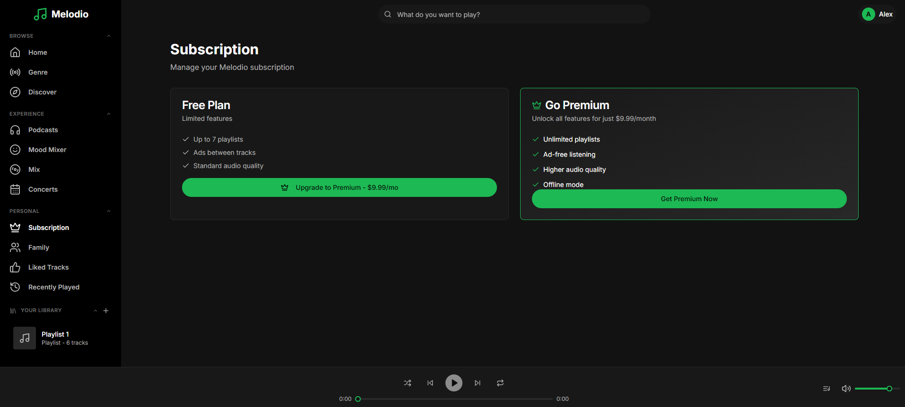
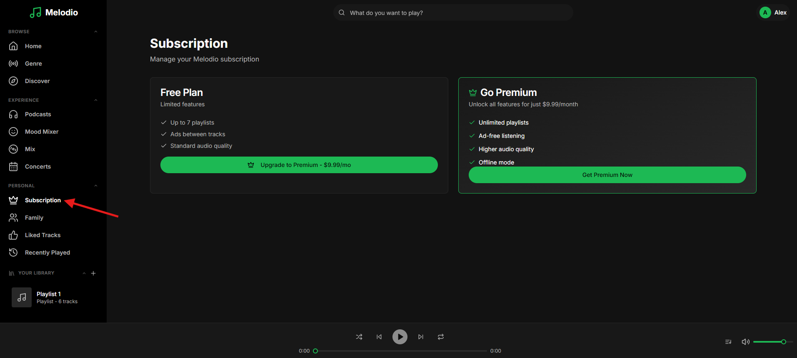
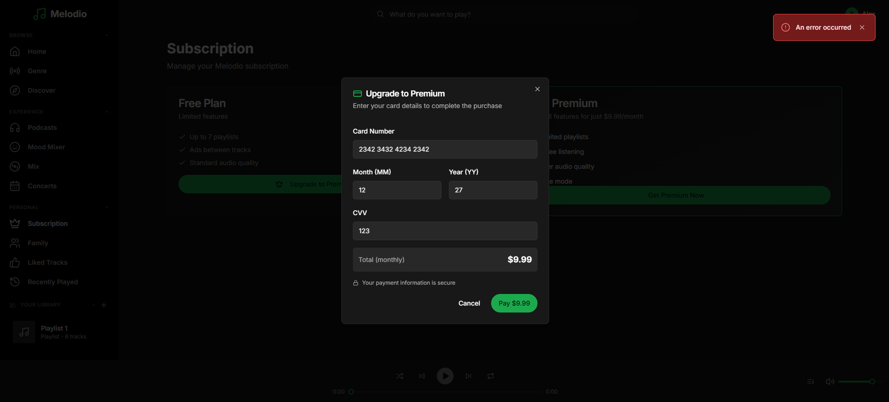

# Bug Fix: Subscription Payment

```
Tags: Theme:Melodio, MERN, backend, BugFix, Medium
Time: 40 mins
Score: 75
```

## Overview

**Skills:** Node.js (Advanced)

Melodio is a music streaming app with a premium subscription model. Users can upgrade from a free to premium plan by paying with a credit or debit card. Premium unlocks adding unlimited playlists.

At the moment, the card payment functionality is completely broken and the subscription never actually upgrades.



## Issue Summary

When a user clicks Pay the payment process crashes. Even if that is resolved, expired credit cards are accepted, the subscription does not upgrade to premium, and the payment status remains Pending. Duplicate payments are not prevented. Your task is to fix these backend issues so the subscription payment flow works smoothly end-to-end.

## Steps to Reproduce

- Log in using test credentials:
  ```
  Email: alex.morgan@melodio.com
  Password: password123
  ```
- Navigate to the Subscription page from the sidebar.

- Click Upgrade to Premium.
- Enter card details and click Pay; observe that the payment fails.
  ```
  Card Number: 4242424242424242
  Expiry Month: 12
  Expiry Year: 50
  CVV: 123
  ```


## Expected Behavior

- Expired cards should be rejected with an appropriate error message.
- After successful payment, the subscription should change to premium with a 30-day duration.
- The payment record status should update to Completed.
- The user's account subscription status should reflect premium.
- Sending the same payment request twice should not create a duplicate payment.

**Note:** Make sure to review the `technical-specs/SubscriptionPayment.md` file carefully to understand all the specifications and expected behavior.
