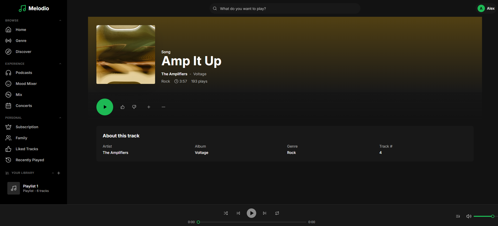
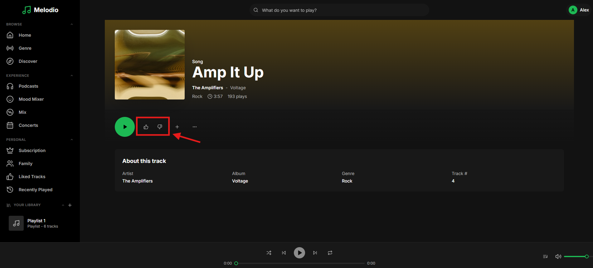
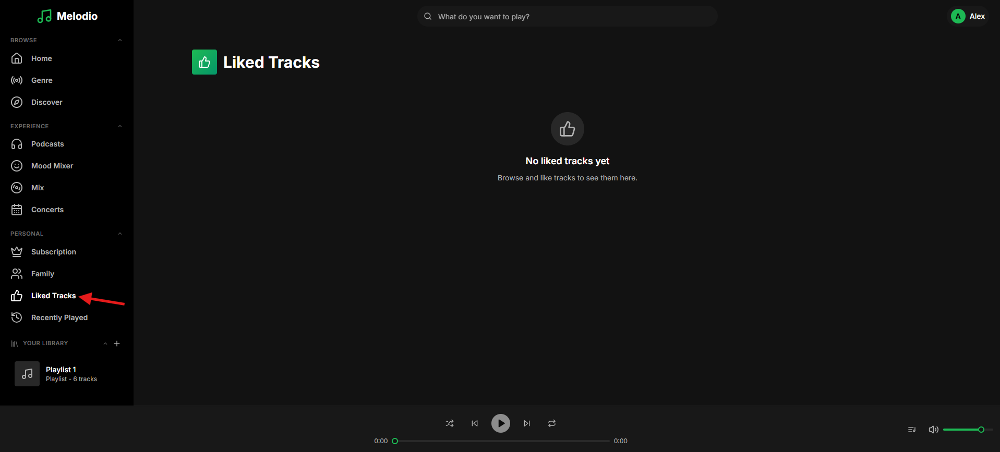

# Bug Fix: Track Like Dislike

```
Tags: Theme:Melodio, MERN, backend, BugFix, Medium
Time: 40 mins
Score: 75
```

## Overview

**Skills:** Node.js (Intermediate)

Melodio is a music streaming app where users can like or dislike individual tracks. Liked tracks are saved to a personal collection for easy access, and the like/dislike status is shown on track cards throughout the app.

At the moment, the track like/dislike system is extensively broken. like/dislike is broken, the liked tracks list doesn't work, and the like status indicator does not reflect the actual state.



## Issue Summary

Like/Dislike functionality is broken. The Liked Tracks page shows incorrect data. The like status indicator does not reflect the actual state. Your task is to fix these backend issues so the track like/dislike system works smoothly end-to-end.

## Steps to Reproduce

- Log in using test credentials:
  ```
  Email: alex.morgan@melodio.com
  Password: password123
  ```
- Click on any track to navigate to the track details page.

- Click the Like/Dislike button on a track; observe nothing works.

- Navigate to the Liked Tracks page from the sidebar; observe nothing shows up.


## Expected Behavior

- Like/Dislike functionality should work.
- The Liked Tracks page should show only liked tracks with correct details, sorted by most recent.
- Pagination should respect the page and limit parameters.
- The like status indicator should return the actual reaction state.
- Reacting to a non-existent track should return an error.

**Note:** Make sure to review the `technical-specs/TrackLikeDislike.md` file carefully to understand all the specifications and expected behavior.
