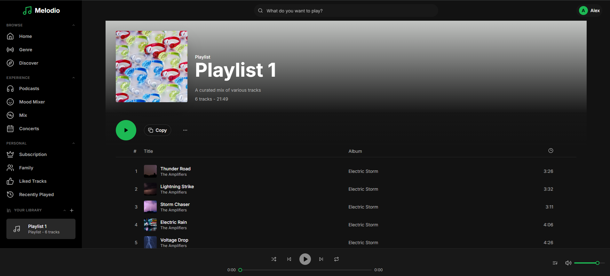
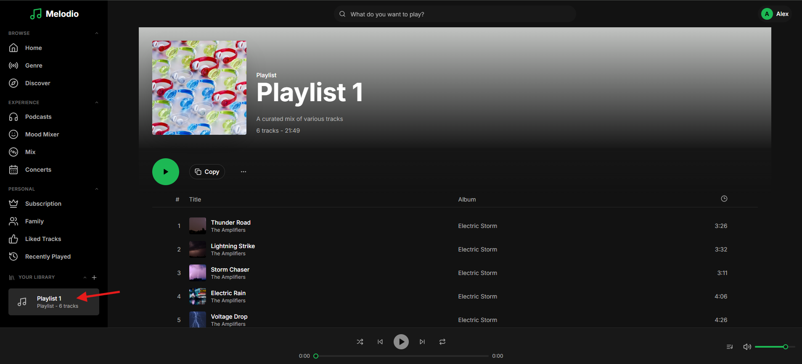
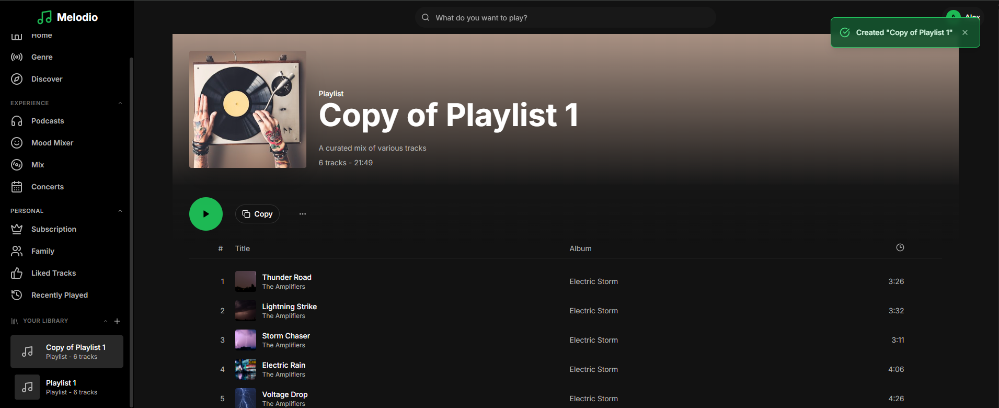

# Feature: Copy Playlist

```
Tags: Theme:Melodio, MERN, backend, Feature Implementation, Easy
Time: 20 mins
Score: 50
```

## Overview

**Skills:** Node.js (Basic)

Melodio is a music streaming app where users can create playlists to organize their favorite tracks. The platform should allow users to copy any public playlist into their library.

Currently, the copy playlist feature is not implemented. Your task is to implement this feature in the backend so that users can easily copy playlists while respecting privacy and ownership rules.



## Product Requirements

- Users should be able to copy any public playlist into their library.
- Copying another user's private playlist should return error.
- The copied playlist name defaults to "Copy of {originalName}" unless a custom name is provided.
- The copied playlist should always be private, with all tracks preserved in order.
- Free users are limited to 7 playlists; exceeding the limit should be rejected with a clear error.

## Steps to Test Functionality

- Log in using test credentials:
  ```
  Email: alex.morgan@melodio.com
  Password: password123
  ```
- Navigate to the existing playlist named Playlist 1 from the sidebar.

- Click the Copy button; observe the playlist is copied.

- Verify the copied playlist appears in your library as a private playlist with all tracks.

**Note:** Make sure to review the `technical-specs/CopyPlaylist.md` file carefully to understand all the specifications and expected behavior.
