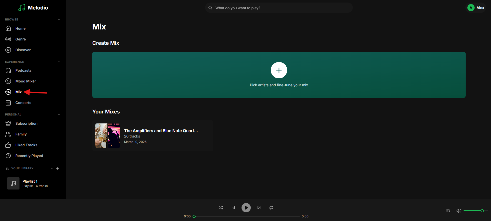
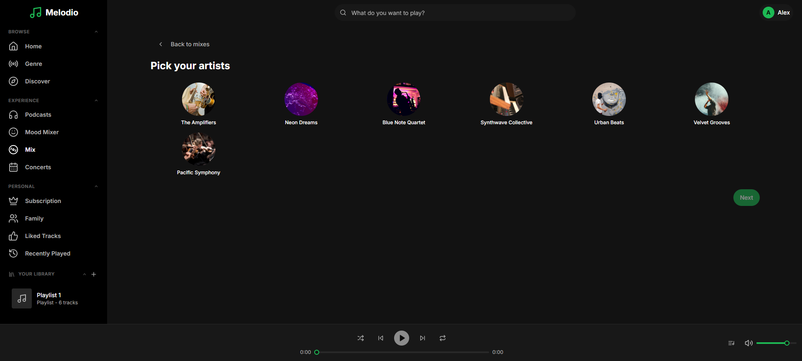
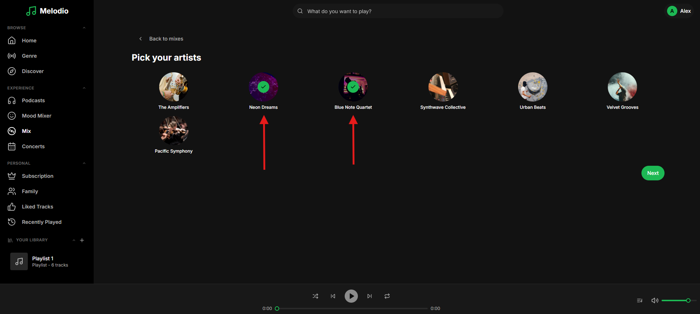
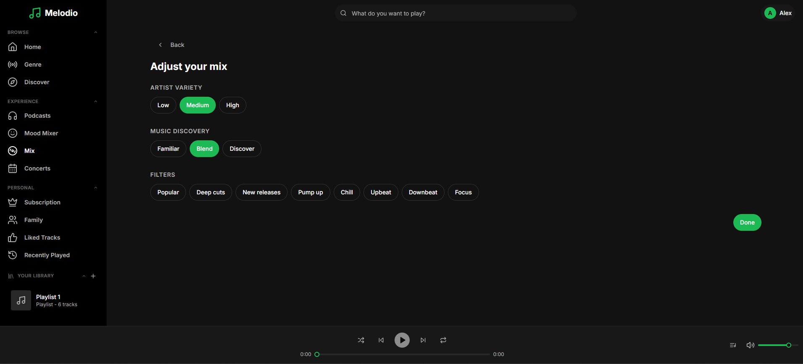
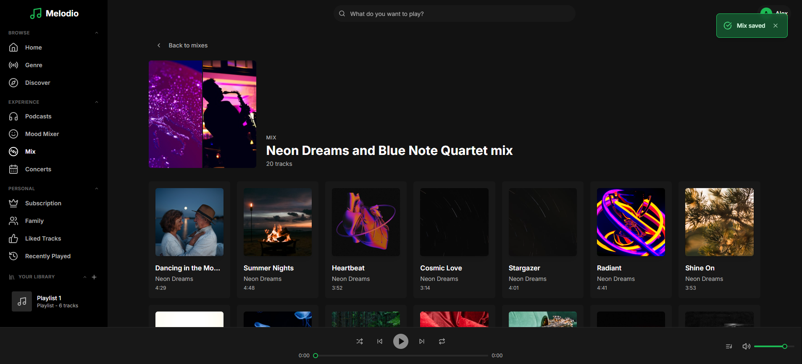

# Feature: Create Mix

```
Tags: Theme:Melodio, MERN, Frontend, Feature Implementation, Hard
Time: 60 mins
Score: 100
```

## Overview

**Skills:** React (Advanced)

Melodio is a music streaming app with a Mix feature that lets users create personalized track collections. The Mix page has a 3-step wizard: select artists, configure mix settings (variety, discovery, filters), and generate a scored mix. Users can also view and manage their saved mixes.

The artist selection grid shows a handful of fake artists instead of real artist data from the database. Selecting an artist has no visual effect. The Next button is permanently disabled. You Mixes option shows nothing. Your task is to implement the frontend feature in the Mix page to make the entire mix creation flow work smoothly end-to-end.


## Product Requirements

- The artist grid should show all available artists from the database.
- Clicking an artist should toggle their selection with a visual indicator.
- On click of Next, the Configuration controls (variety, discovery, filters) should be visible and interactive.
- Clicking Done should generate a scored mix based on selected artists and configuration.
- The mix title should be auto-generated from selected artist names.
- Previously created mixes should appear in the Your Mixes section on page load.

## Steps to Test Functionality

- Log in using test credentials:
  ```
  Email: alex.morgan@melodio.com
  Password: password123
  ```
- Click on the Mix page from the sidebar.

- Your Mixes shows saved mixes.
- Click the Create Mix card to start the wizard.

- Artists list appears.

- Artists can be selected/deselected with visual feedback and click Next.

- Configuration options appear.

- Configure variety, discovery, and filters; click Done.
- A scored mix is generated with a title based on selected artists.


**Note:** Make sure to review the `technical-specs/CreateMix.md` file carefully to understand all the specifications and expected behavior.
