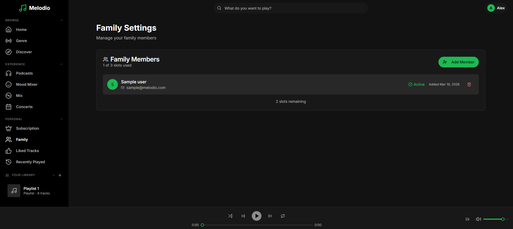
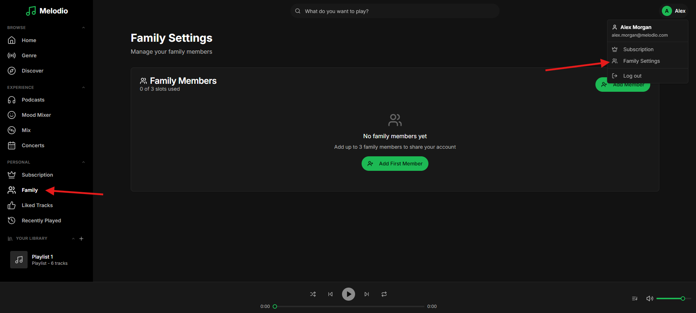
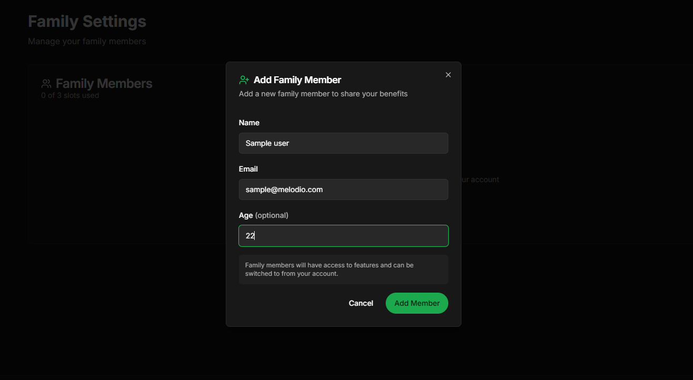
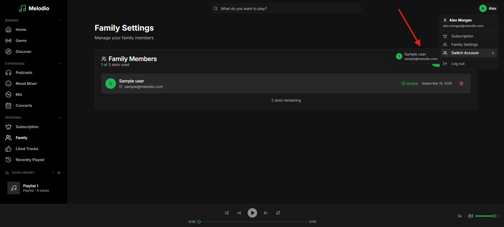

# Feature: Family Management

```
Tags: Theme:Melodio, MERN, backend, Feature Implementation, Hard
Time: 60 mins
Score: 100
```

## Overview

**Skills:** Node.js (Advanced)

Melodio is a music streaming app that supports family accounts. Primary account holders can add family members, who get their own profiles and can be switched to seamlessly.

Currently, the family management feature is not functional; family members, account switching, and access controls all need to be implemented correctly. Your task is to implement the family member management and account switching features in the backend so they work smoothly end-to-end.



## Product Requirements

- When a primary user adds a family member, the member should be usable immediately.
- A primary user should be able to switch to any of their own family members' accounts.
- A family member should only be able to switch back to their primary account; not to other family members.

## Steps to Test Functionality

- Log in using test credentials:
  ```
  Email: alex.morgan@melodio.com
  Password: password123
  ```
- Click on the user profile at the top right of the screen and click on Family settings. You can also click on the Family page from the sidebar for the same page.

- Fill the form to add new family member.

- Click on Switch Account from the user profile dropdown to switch to the newly created family member account.

- From the family member, switching back to the primary account should be possible from the user profile dropdown.

**Note:** Make sure to review the `technical-specs/FamilyManagement.md` file carefully to understand all the specifications and expected behavior.
