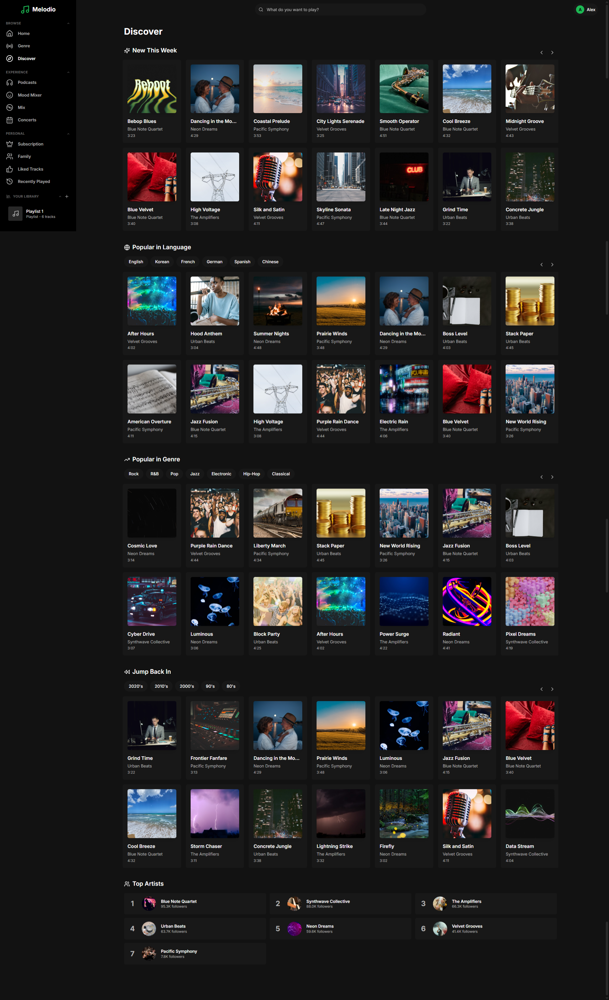
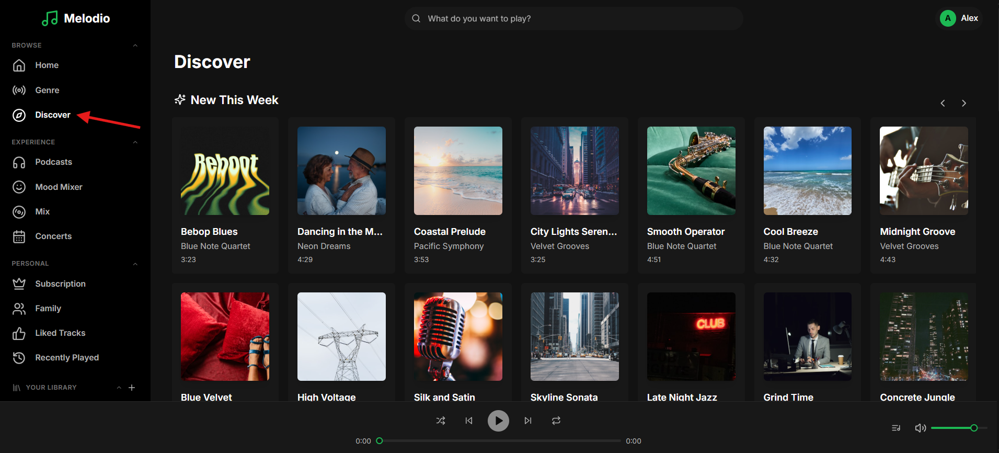

# Feature: Music Discovery

```
Tags: Theme:Melodio, MERN, Frontend, Feature Implementation, Medium
Time: 40 mins
Score: 75
```

## Overview

**Skills:** React (Advanced)

Melodio is a music streaming app with a Discovery page that helps users explore music through multiple filter dimensions; language, genre, and era; along with a "New This Week" section and a "Top Artists" ranking.

The page shows dummy tracks instead of real data from the database. No filter chips appear for language, genre, or era. The "New This Week" section shows only placeholder tracks. All filtered sections and "Top Artists" are empty. Your task is to implement the frontend feature so the Discovery page works smoothly end-to-end.



## Product Requirements

- Language, genre, and era filter chips should appear with correct options.
- "New This Week" should display tracks created within the last 7 days.
- Selecting a filter chip should show matching tracks from the database.
- Genre display names should be properly formatted (e.g., "R&B" not "r-and-b").
- "Top Artists" should display artists sorted by follower count.

## Steps to Test Functionality

- Log in using test credentials:
  ```
  Email: alex.morgan@melodio.com
  Password: password123
  ```
- Click on the Discover page from the sidebar.

- "New This Week" section shows tracks created in the last 7 days.
- Filter chips for language, genre, and era are visible.
- Click on a language filter; observe tracks update to match the filter.
- Click on a genre filter; observe tracks update to match the filter.
- Click on an era filter; observe tracks update to match the filter.
- "Top Artists" section shows artists sorted by follower count with correct genre tags.

**Note:** Make sure to review the `technical-specs/MusicDiscovery.md` file carefully to understand all the specifications and expected behavior.
