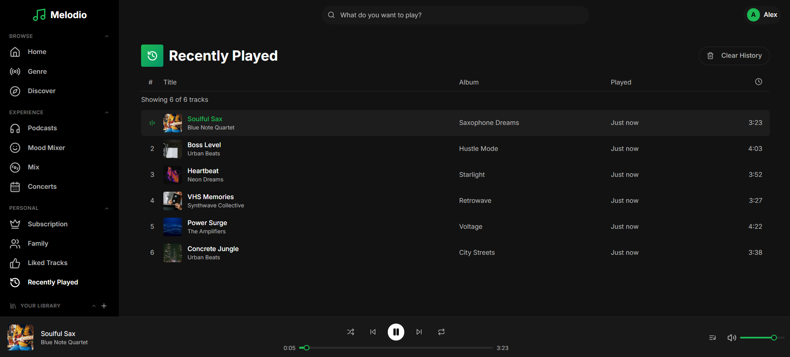
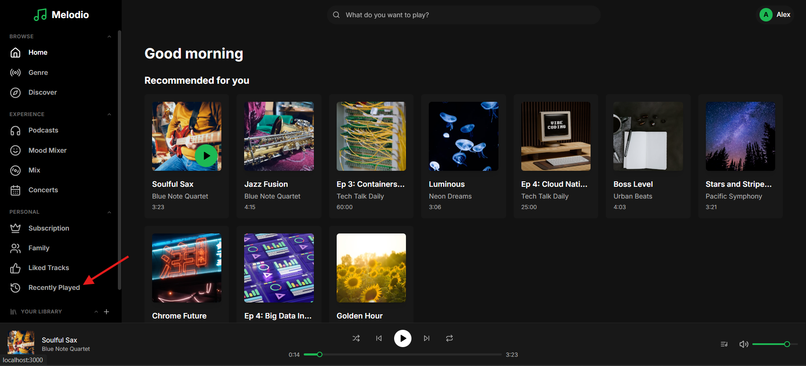
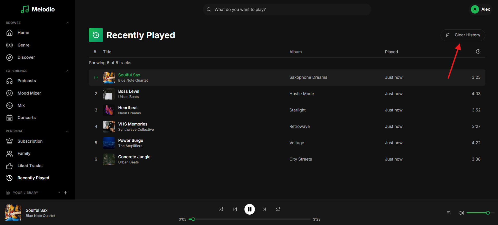

# Feature: Recently Played Tracks

```
Tags: Theme:Melodio, MERN, backend, Feature Implementation, Medium
Time: 40 mins
Score: 75
```

## Overview

**Skills:** Node.js (Basic)

Melodio is a music streaming app that lets users discover and listen to music. The platform should maintain a play history so users can revisit tracks they have recently enjoyed.

Currently, the recently played feature is not implemented. Your task is to implement the recently played tracks feature in the backend so that users can view their play history, which should be accurate and up-to-date.



## Product Requirements

- When a user plays a track, the play should be recorded in the Liked Tracks page.
- Maximum history size is 50 entries per user; oldest entries are removed when the limit is reached.
- Users should be able to retrieve recently played tracks sorted by most recent, with full track details.
- Users should be able to clear their entire play history.

## Steps to Test Functionality

- Log in using test credentials:
  ```
  Email: alex.morgan@melodio.com
  Password: password123
  ```
- Play several tracks from different albums and artists in the home page.
- Navigate to the Recently Played page from the sidebar.

- The played tracks appear sorted by most recent first with correct details.
- Clicking on Clear History clears the list.


**Note:** Make sure to review the `technical-specs/RecentlyPlayed.md` file carefully to understand all the specifications and expected behavior.
